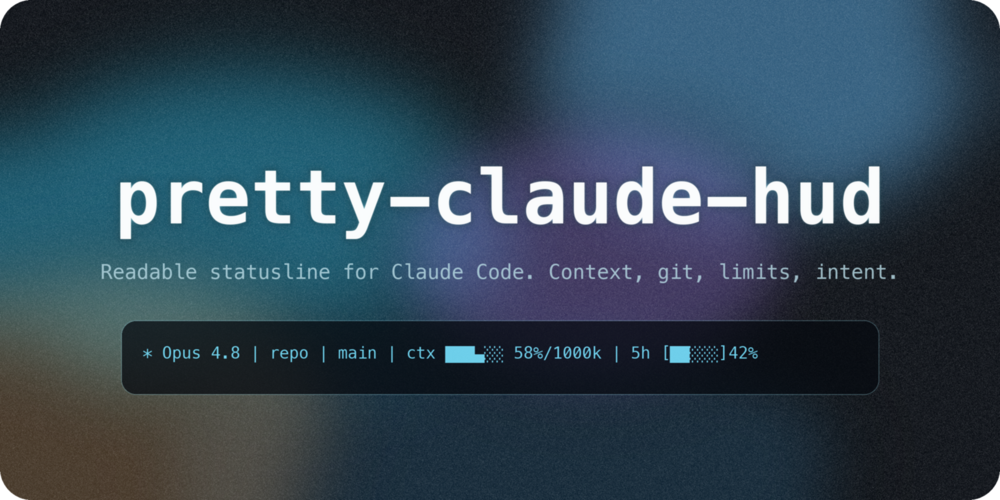

<p align="center">
  
</p>

# pretty-claude-hud

A Claude Code statusline that makes the working state readable without turning the bottom of the terminal into a dashboard.

> **English** | [한국어](README-Ko-KR.md)

## What It Shows

- **Model and project** — Active model and current folder, visible without scanning the conversation pane.
- **Context meter** — Compact token usage bar with the current context window size.
- **Git awareness** — Branch, changed-file count, and upstream sync state when the current folder is a repo.
- **Rate-limit meters** — 5-hour and weekly usage bars when Claude Code OAuth usage data is available.
- **Last-message recall** — A subtle second line with your latest prompt, trimmed to match the HUD width.
- **Terminal-native shape** — Built for Nerd Fonts, Powerlevel10k-style prompts, and dark terminal themes.

## Design Stance

**Thesis:** a Claude Code HUD should behave like a good shell prompt: compact, glanceable, and quiet until a number matters.

**Antithesis:** a pretty HUD can become noise when it chases badges, gradients, and labels that do not help the next action.

**Synthesis:** this repo keeps one dense statusline plus one intent line. The visual treatment is there to rank information, not to decorate it.

## Quick Start

### Using an LLM

Paste this into Claude Code, Codex, or another coding assistant:

```text
Clone https://github.com/wjgoarxiv/pretty-claude-hud to my home directory and run install.sh. Stop before changing anything if ~/.claude/settings.json has unusual statusLine settings.
```

### Manual Install

```bash
git clone https://github.com/wjgoarxiv/pretty-claude-hud.git ~/pretty-claude-hud
bash ~/pretty-claude-hud/install.sh
```

Restart Claude Code or open a new session after installation.

## Installer Behavior

1. Copies `context-bar.sh` to `~/.claude/hud/context-bar.sh`.
2. Backs up `~/.claude/settings.json` when it already exists.
3. Writes this statusline command:

```json
{
  "statusLine": {
    "type": "command",
    "command": "bash \"$HOME/.claude/hud/context-bar.sh\""
  }
}
```

Preview the plan without writing files:

```bash
bash install.sh --dry-run
```

## Requirements

- Claude Code with `statusLine` command support.
- `bash`, `jq`, `git`, and `curl`.
- A Nerd Font is recommended. JetBrainsMono Nerd Font, Hack Nerd Font, Meslo Nerd Font, and D2CodingLigature Nerd Font all work well.

## Themes

Set a theme with an environment variable before launching Claude Code:

```bash
export CLAUDE_HUD_THEME=cyan
```

Available themes:

| Theme | Mood |
| --- | --- |
| `blue` | calm default |
| `cyan` | crisp terminal glow |
| `teal` | muted productivity |
| `green` | classic shell |
| `gold` | warm focus |
| `rose` | soft contrast |
| `lavender` | quiet purple |
| `orange` | high energy |
| `slate` | low saturation |
| `gray` | monochrome |

Disable color:

```bash
export CLAUDE_HUD_NO_COLOR=1
```

## Verify

```bash
bash -n context-bar.sh
bash -n install.sh
tests/run-tests.sh
```

## Uninstall

Remove the installed script and restore your previous `settings.json` backup manually:

```bash
rm -f ~/.claude/hud/context-bar.sh
ls -t ~/.claude/settings.json.bak.* 2>/dev/null | head -1
```

Then copy the backup you want back to `~/.claude/settings.json`.

## Design Note

The goal is not decoration for decoration's sake. The HUD should make Claude Code easier to drive: model, folder, git state, context pressure, rate-limit pressure, and the last user intent should be visible in one glance.

## License

MIT License — see `LICENSE`.
